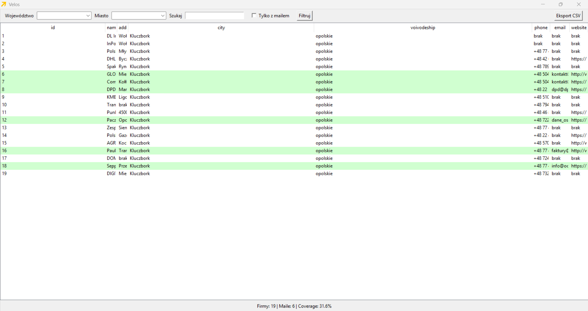
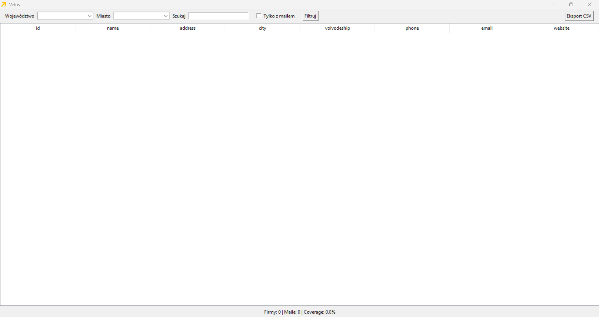

# Velos – Google Maps Lead Scraper

Velos is a Python automation tool that collects company data from Google Maps and builds a structured lead database.

The application is designed for lead generation, market research, and recruitment prospecting.

---

# Features

- Google Maps scraping
- Company data extraction
- Website email crawler
- SQLite database storage
- CSV export
- GUI application (Tkinter)
- Executable desktop build

Collected data includes:

- Company name
- City
- Voivodeship
- Address
- Phone number
- Website
- Email
- Source
- Scrape date

---

# Technologies Used

Python

Libraries:

- Playwright
- Pandas
- SQLite3
- Tkinter
- Requests
- BeautifulSoup

---

# Installation

Clone the repository

```
git clone https://github.com/czuameni/velos-web-scraper.git
```

Install dependencies

```
pip install -r requirements.txt
```

Install Playwright browser

```
playwright install
```

---

# Usage

Run scraper

```
python pbc.py
```

Run GUI

```
python gui_app.py
```

---

# Project Structure

```
maps_scraper.py
website_crawler.py
email_extractor.py
db.py
exporter.py
gui_app.py
config.py
keywords.txt
regions.txt
cities_opolskie.txt
requirements.txt
```

## Application Preview

### Main Interface (data deliberately hidden)


### Email filter applied (shows only those positions where email address is present)

---

# Example Use Cases

- recruitment lead generation
- business development prospecting
- market research
- company database building

## Installation

Clone the repository:

```bash
git clone https://github.com/czuameni/velos-web-scraper.git
